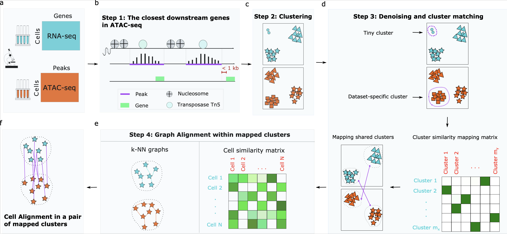

# AIscEA: Integration of Single-cell Gene Expression and Chromatin Accessibility via Their Biological Consistency



## Enviroment
python >= 3.6

numpy >= 1.18.5

scanpy >= 1.6.0

scipy >= 1.4.1

## Examples
### Preprocessing steps
This step includes Preprocessing single-cell ATAC-seq data for AIscEA. More details can be found in [preprocessing directory](https://github.com/elhaam/Alignment/blob/main/preprocessing/).

### Alignment using AIscEA method
IPython Jupyter notebook files are provided for various real-world datasets, including:
1. SNARE-seq Mouse Dataset 5k [results in IPython notebook](https://github.com/elhaam/AIscEA/blob/main/examples/PBMC_5k.ipynb)
2. SNARE-seq Mouse Dataset 10k [results in IPython notebook](https://github.com/elhaam/AIscEA/blob/main/examples/PBMC_10k.ipynb)
3. PBMC 3k [results in IPython notebook](https://github.com/elhaam/AIscEA/blob/main/examples/PBMC_3k.ipynb)
4. PBMC 12k [results in IPython notebook](https://github.com/elhaam/AIscEA/blob/main/examples/PBMC_12k.ipynb)


## BibTEX citation
To be added soon.

## References for the datasets
Reference:
```
@article{chen2019high,
  title={High-throughput sequencing of the transcriptome and chromatin accessibility in the same cell},
  author={Chen, Song and Lake, Blue B and Zhang, Kun},
  journal={Nature biotechnology},
  volume={37},
  number={12},
  pages={1452--1457},
  year={2019},
  publisher={Nature Publishing Group}
}
```
```
  @article{pbmc_3k,
   title={PBMC from a healthy donor - granulocytes removed through cell sorting (3k), Single Cell Multiome ATAC + Gene Expression Dataset by Cell Ranger ARC 2.0.0},
   author={10x Genomics},
   journal={},
   volume={},
   number={},
   pages={},
   year={2021},
   publisher={}
 }
 ```

 ```
   @article{pbmc_12k,
   title={PBMC from a healthy donor - granulocytes removed through cell sorting (10k),
Single Cell Multiome ATAC + Gene Expression Dataset by Cell Ranger ARC 2.0.0},
   author={10x Genomics},
   journal={},
   volume={},
   number={},
   pages={},
   year={2021},
   publisher={}
 }
 ```


## Questions
Please send an email to [Elham Jafari](mailto:ejafari@indiana.edu?subject=[GitHub]%20Source%20AIscEA).